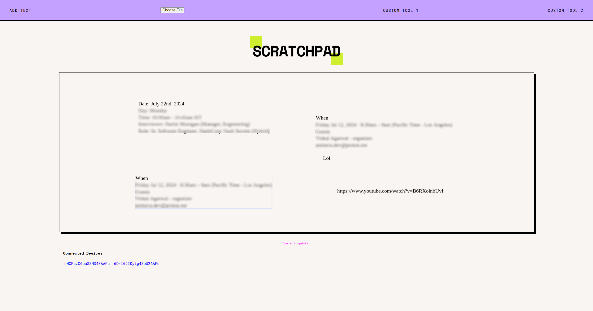
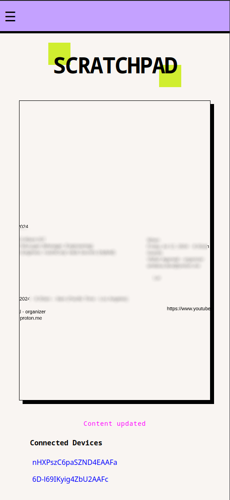

# scratchpad

How dare I am unable to share text or whatever between my devices, on my network. 
The usual solutions include using whatsapp or manual copy pasta methods. 

Also text doesn't need to be dumb, with my recent interests in LLM and building
models in general, there can be inbuilt plugin like functionality to act on the text,
given enough context.

## Requirements

- nodejs
- pm2

## Running

- `make run`
- make sure to allow connections to port `3001`. (fedora has firewall enabled by default)
- access on your `ip-address:3001`

## Screenshots

_since this, the device names are made unique instead of socket ids_

### Working

Once you launch the UI, you are suppossed to enter a set password.
You can set a default password, or you can generate one. (This is a manual process now).

Every device trying to join the scratchpad has to go through the authentication layer.
Now you can:

- add text
- click and hold to copy
- zoom in and out of the canvas

